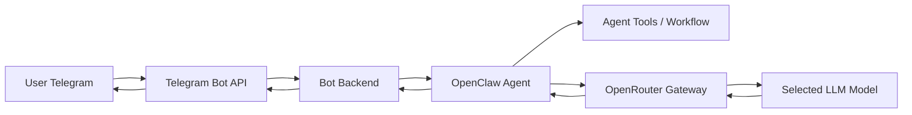

# AI Telegram OpenClaw Bot

AI Telegram chatbot yang menggunakan OpenClaw sebagai agent orchestration layer dan OpenRouter sebagai LLM gateway. Project ini dibuat untuk membangun chatbot yang bisa diakses melalui Telegram, menjalankan workflow agent, dan memilih model LLM secara fleksibel melalui OpenRouter.

## Demo

### Telegram Chat

Simpan screenshot percakapan Telegram ke path berikut agar tampil otomatis di GitHub:

```txt
docs/screenshots/telegram-chat-demo.png
```


### OpenRouter Model Selection

Simpan screenshot pemilihan model atau konfigurasi model ke path berikut:

```txt
docs/screenshots/openrouter-model-selection.png
```


### Demo Video

Simpan video demo ke path berikut:

```txt
docs/videos/telegram-bot-demo.mp4
```

[Watch Telegram bot demo](docs/videos/telegram-bot-demo.mp4)

## Project Overview

Project ini menghubungkan tiga komponen utama:

- Telegram sebagai interface chat untuk user.
- OpenClaw sebagai runtime/orchestration layer untuk agent, tools, dan workflow.
- OpenRouter sebagai gateway untuk memilih berbagai model LLM tanpa mengubah core logic aplikasi.

Dengan arsitektur ini, chatbot bisa dikembangkan menjadi assistant yang lebih fleksibel, misalnya untuk customer support, personal assistant, automation bot, atau agent berbasis tool calling.

## Key Features

- Chatbot dapat diakses langsung dari Telegram.
- Integrasi OpenClaw untuk menjalankan AI agent workflow.
- Integrasi OpenRouter untuk routing model LLM.
- Konfigurasi aman melalui environment variables.
- Struktur repository siap untuk portfolio GitHub.
- Dokumentasi setup tanpa menyimpan token/API key pribadi.
- Slot dokumentasi untuk screenshot dan video demo.

## Tech Stack

- Telegram Bot API
- OpenClaw
- OpenRouter
- Node.js
- JavaScript / TypeScript
- GitHub

## Architecture



## How It Works

1. User mengirim pesan ke bot melalui Telegram.
2. Telegram Bot API meneruskan pesan ke backend aplikasi.
3. Backend memproses pesan dan meneruskannya ke OpenClaw agent.
4. OpenClaw menjalankan instruksi, tools, atau workflow agent yang dibutuhkan.
5. Request LLM dikirim ke OpenRouter.
6. OpenRouter meneruskan request ke model yang dipilih.
7. Response model dikembalikan ke OpenClaw, lalu dikirim kembali ke user Telegram.

## Repository Structure

```txt
src/
  bot/        Telegram handler, command, dan message routing.
  agent/      Integrasi OpenClaw agent dan tools.
  llm/        Integrasi OpenRouter dan daftar model.
  config/     Validasi environment variables dan runtime config.
docs/
  screenshots/
    telegram-chat-demo.png
    openrouter-model-selection.png
  videos/
    telegram-bot-demo.mp4
  architecture.md
  setup-openclaw.md
  demo.md
tests/
.env.example
.gitignore
openclaw.example.json
README.md
```

## Environment Variables

Salin `.env.example` menjadi `.env`, lalu isi credential di mesin lokal atau platform deployment.

```env
TELEGRAM_BOT_TOKEN=
OPENROUTER_API_KEY=
OPENROUTER_BASE_URL=https://openrouter.ai/api/v1
DEFAULT_MODEL=openai/gpt-4.1-mini
OPENCLAW_HOME=
NODE_ENV=development
```

Jangan commit file `.env`, token Telegram, API key OpenRouter, atau folder konfigurasi `.openclaw`.

## OpenClaw Setup

Contoh lokasi OpenClaw di WSL:

```txt
/home/afiyantorfid/.openclaw
/home/afiyantorfid/.nvm/versions/node/v22.16.0/lib/node_modules/openclaw
```

Folder `.openclaw` tidak dimasukkan langsung ke repository karena dapat berisi konfigurasi pribadi, token, session, cache, atau data runtime. Repository ini hanya menyimpan contoh konfigurasi dan dokumentasi setup yang aman untuk GitHub.

## OpenRouter Model Routing

OpenRouter digunakan agar bot bisa mengganti model LLM tanpa mengubah integrasi utama dengan Telegram dan OpenClaw.

Contoh model yang bisa dikonfigurasi:

- `openai/gpt-4.1-mini`
- `anthropic/claude-3.7-sonnet`
- `deepseek/deepseek-chat`
- `google/gemini-pro`

Model default disimpan melalui environment variable:

```env
DEFAULT_MODEL=openai/gpt-4.1-mini
```

## Security Notes

File dan data berikut tidak boleh masuk GitHub:

- `.env`
- `.openclaw/`
- `openclaw.json`
- `openclaw.json.bak`
- Telegram bot token
- OpenRouter API key
- Session/cache runtime
- Log percakapan yang mengandung data pribadi

## Media Checklist

Sebelum repository dipublikasikan, pastikan file demo berikut sudah ditambahkan:

```txt
docs/screenshots/telegram-chat-demo.png
docs/screenshots/openrouter-model-selection.png
docs/videos/telegram-bot-demo.mp4
```

Sebelum upload, blur atau sembunyikan token, API key, chat ID, nomor telepon, username pribadi, dan data percakapan sensitif.

## Roadmap

- Menambahkan command Telegram untuk memilih model.
- Menambahkan memory percakapan.
- Menambahkan tool calling melalui OpenClaw.
- Menambahkan test untuk handler Telegram dan OpenRouter client.
- Menambahkan deployment guide untuk VPS, Railway, Render, atau Vercel.

