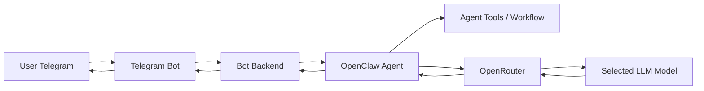

# AI Telegram OpenClaw Bot

AI chatbot yang dapat diakses melalui Telegram, menggunakan OpenClaw sebagai agent orchestration layer dan OpenRouter sebagai gateway untuk memilih model LLM.

## Ringkasan

Project ini dibuat sebagai integrasi AI agent dengan channel chat nyata. Telegram menjadi antarmuka pengguna, OpenClaw menangani agent/tools/workflow, dan OpenRouter menyediakan akses fleksibel ke berbagai model LLM.

## Fitur Utama

- Chatbot berbasis Telegram.
- Integrasi OpenClaw untuk alur agent.
- Integrasi OpenRouter untuk pemilihan model LLM.
- Konfigurasi melalui environment variables.
- Dokumentasi setup yang aman tanpa credential pribadi.
- Struktur repository siap dikembangkan untuk demo portofolio.

## Tech Stack

- Telegram Bot API
- OpenClaw
- OpenRouter
- Node.js / TypeScript atau JavaScript
- GitHub sebagai portfolio repository

## Arsitektur




## Environment Variables

Salin `.env.example` menjadi `.env`, lalu isi credential di mesin lokal atau platform deployment.

```env
TELEGRAM_BOT_TOKEN=
OPENROUTER_API_KEY=
OPENROUTER_BASE_URL=https://openrouter.ai/api/v1
DEFAULT_MODEL=openai/gpt-4.1-mini
OPENCLAW_HOME=
NODE_ENV=development
```
