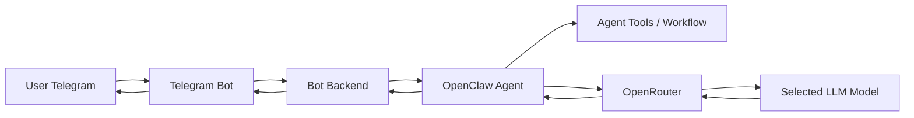

# AI Telegram OpenClaw Bot

AI chatbot yang dapat diakses melalui Telegram, menggunakan OpenClaw sebagai agent orchestration layer dan OpenRouter sebagai gateway untuk memilih model LLM.

## Ringkasan

Project ini dibuat sebagai integrasi AI agent dengan channel chat nyata. Telegram menjadi antarmuka pengguna, OpenClaw menangani agent/tools/workflow, dan OpenRouter menyediakan akses fleksibel ke berbagai model LLM.

## Fitur Utama

- Chatbot berbasis Telegram.
- Integrasi OpenClaw untuk alur agent.
- Integrasi OpenRouter untuk pemilihan model LLM.
- Konfigurasi melalui environment variables.
- Dokumentasi setup yang aman tanpa credential pribadi.
- Struktur repository siap dikembangkan untuk demo portofolio.

## Tech Stack

- Telegram Bot API
- OpenClaw
- OpenRouter
- Node.js / TypeScript atau JavaScript
- GitHub sebagai portfolio repository

## Arsitektur



## Struktur Repository

```txt
src/
  bot/
  agent/
  llm/
  config/
docs/
  screenshots/
  architecture.md
  setup-openclaw.md
  demo.md
tests/
.env.example
.gitignore
openclaw.example.json
README.md
```

## Environment Variables

Salin `.env.example` menjadi `.env`, lalu isi credential di mesin lokal atau platform deployment.

```env
TELEGRAM_BOT_TOKEN=
OPENROUTER_API_KEY=
OPENROUTER_BASE_URL=https://openrouter.ai/api/v1
DEFAULT_MODEL=openai/gpt-4.1-mini
OPENCLAW_HOME=
NODE_ENV=development
```

Jangan commit file `.env`, token Telegram, API key OpenRouter, atau folder konfigurasi `.openclaw`.

## OpenClaw

Folder OpenClaw lokal biasanya berada di:

```txt
/home/<linux-user>/.openclaw
```

Untuk project portfolio, folder tersebut tidak dimasukkan langsung ke GitHub. Repository ini hanya menyimpan contoh konfigurasi, dokumentasi setup, dan kode integrasi yang aman dibagikan.

## Demo

Tambahkan screenshot atau video singkat ke folder `docs/screenshots/`, misalnya:

- Percakapan user dengan bot Telegram.
- Contoh pemilihan model LLM.
- Contoh response dari AI agent.
- Contoh error handling ketika provider/model gagal.

## Roadmap

- Menambahkan command Telegram untuk memilih model.
- Menambahkan memory percakapan.
- Menambahkan tool calling melalui OpenClaw.
- Menambahkan test untuk handler Telegram dan OpenRouter client.
- Menambahkan deployment guide untuk VPS, Railway, Render, atau Vercel.

## Security Notes

File berikut tidak boleh masuk GitHub:

- `.env`
- `.openclaw/`
- `openclaw.json`
- API key dan token pribadi
- Session/cache runtime
- Log yang mengandung data user

